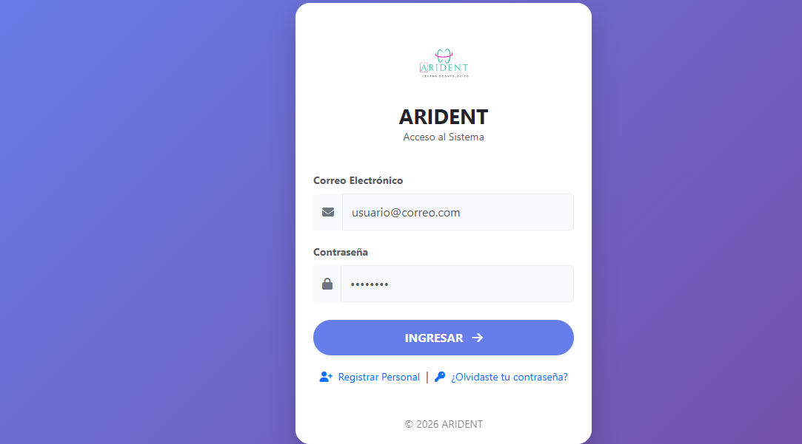
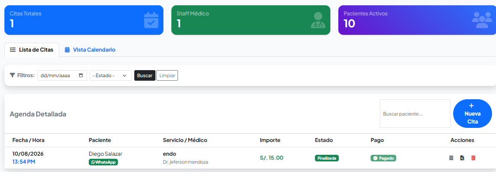
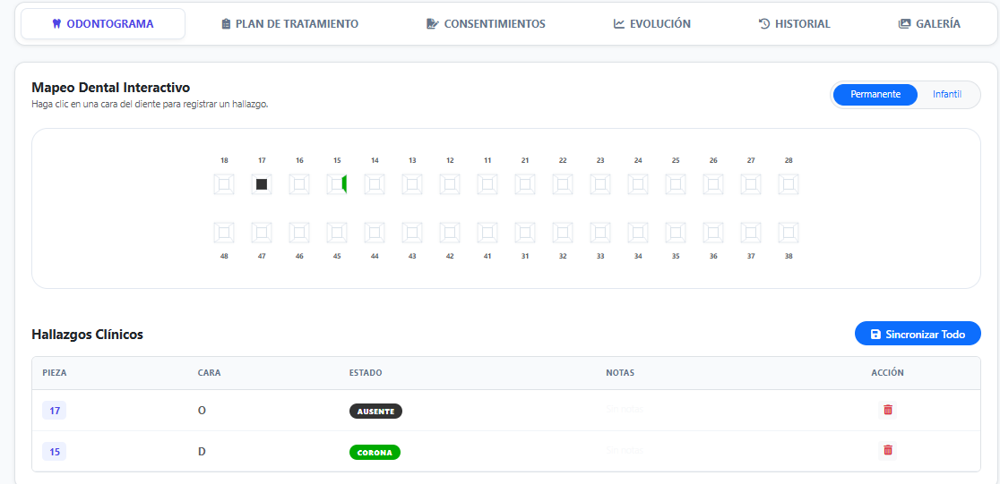

# Aridént – Sistema de Gestión de Citas Odontológicas

Sistema web para gestionar la atención de un consultorio odontológico:
registro de pacientes, programación de citas y manejo de odontogramas.
Su objetivo es optimizar el consultorio, reducir los tiempos de atención
y ordenar el registro de pacientes.

## Funcionalidades
- Registro y consulta de pacientes
- Programación y gestión de citas
- Odontograma por paciente
  [Agrega aquí login, roles, reportes u otras funciones que tenga]

## Tecnologías
- PHP
- SQL ([MySQL / SQL Server])
- [HTML, CSS, JavaScript, Bootstrap, si los usaste]

## Capturas de pantalla

## Instalación
1. Clona el repositorio.
2. Importa `database/aridant.sql` en tu servidor de base de datos.
3. Configura las credenciales en `[nombre de tu archivo de conexión]`.
4. Ejecuta el proyecto en un servidor local (XAMPP, Laragon, etc.).

## Nota
Los datos incluidos son ficticios y solo con fines demostrativos.

## Autor
**Jeferson Rodrigo Mendoza Monsalve**
Estudiante de Ingeniería de Sistemas Computacionales – UPN
[LinkedIn](https://www.linkedin.com/in/jeferson-rodrigo-mendozamonsalve-150589385/)
